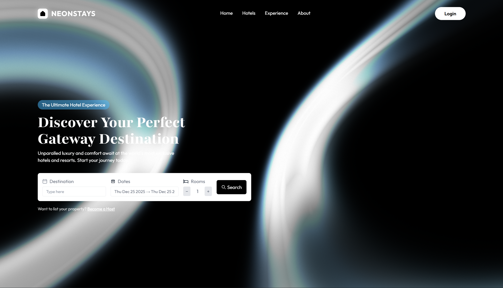
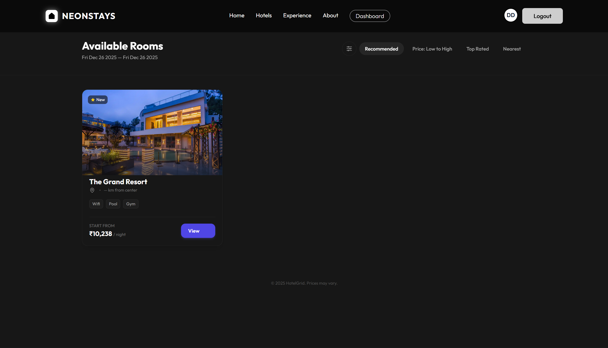
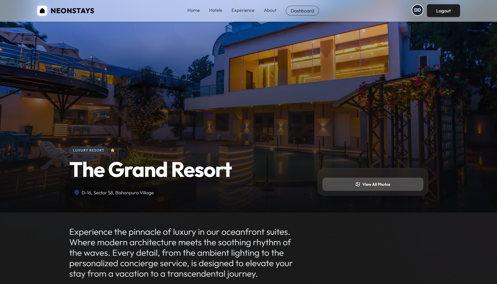
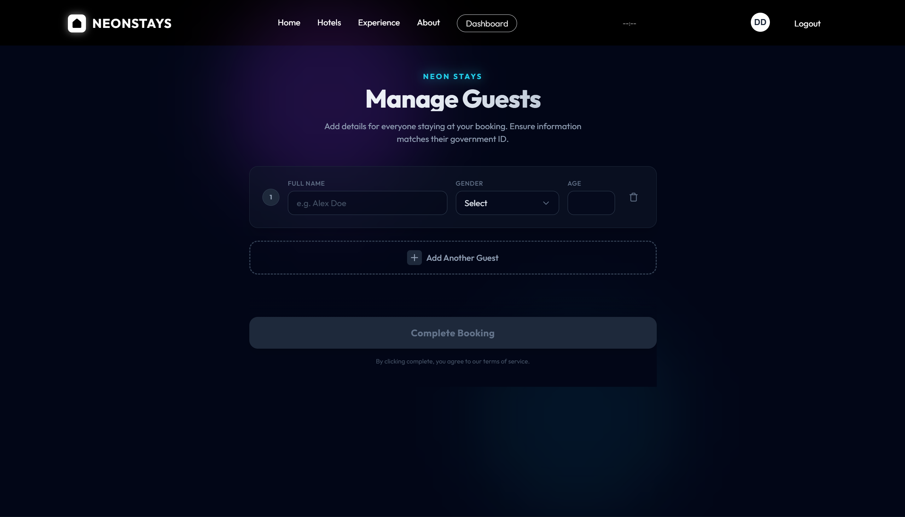
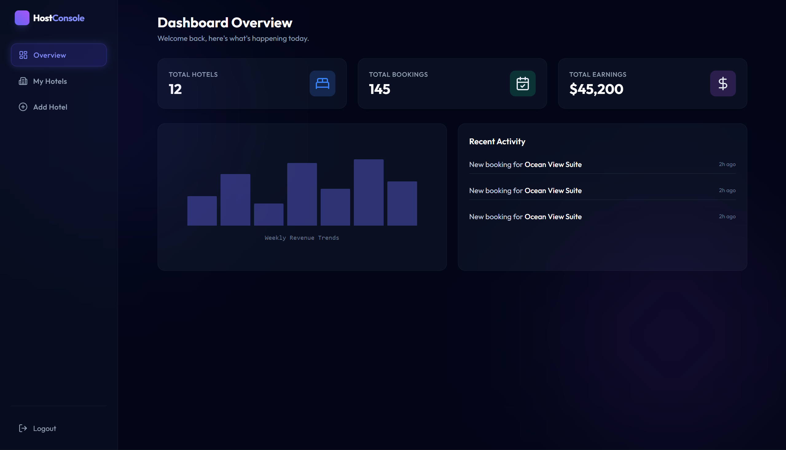
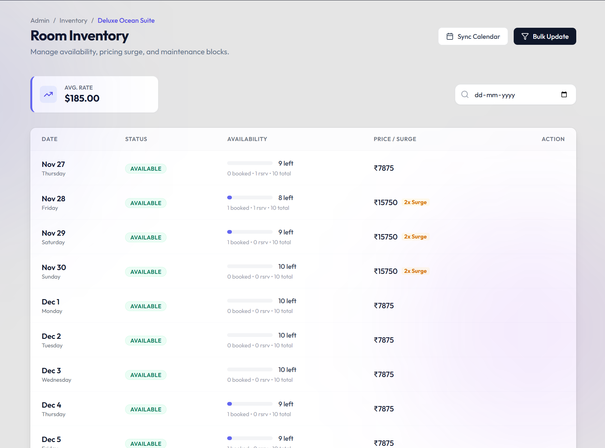
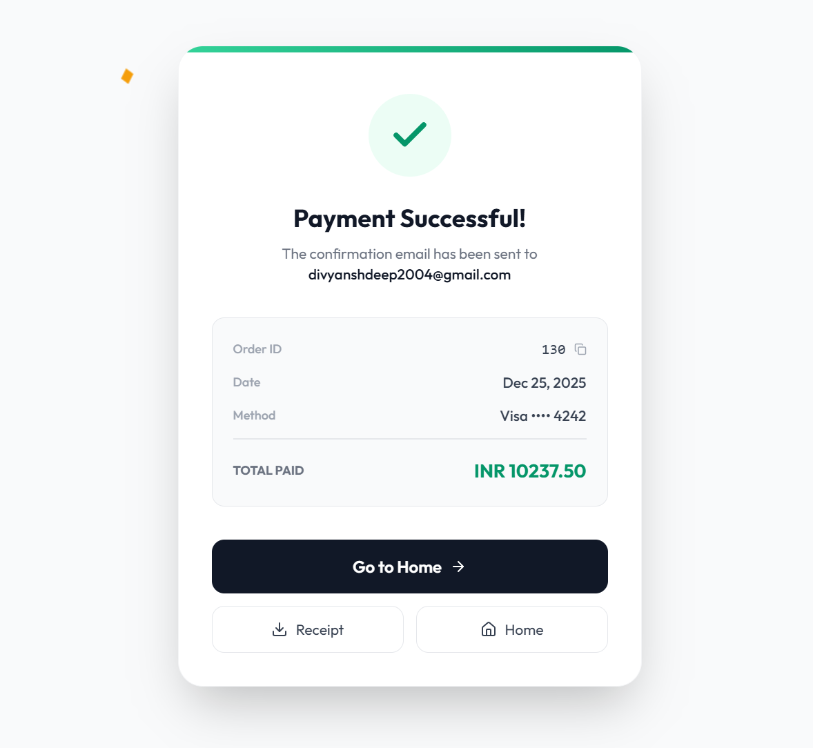

# 🏨 NeonStays - Modern Hotel Booking Platform

A full-featured, modern hotel booking platform built with React and Vite. NeonStays provides a seamless experience for both guests looking to book accommodations and hotel owners managing their properties.

🌐 **Live Demo**: [https://neonstays.vercel.app/](https://neonstays.vercel.app/)


## 📋 Table of Contents

- [Features](#-features)
- [Tech Stack](#-tech-stack)
- [Prerequisites](#-prerequisites)
- [Installation](#-installation)
- [Environment Variables](#-environment-variables)
- [Running the Project](#-running-the-project)
- [Project Structure](#-project-structure)
- [Screenshots](#-screenshots)
- [API Integration](#-api-integration)
- [Deployment](#-deployment)
- [Contributing](#-contributing)

## ✨ Features

### 👥 Guest Features
- **Hotel Search & Discovery**: Browse and search through available hotels with advanced filtering
- **Hotel Details**: View comprehensive hotel information, amenities, and room details
- **Booking Management**: Complete booking flow with guest information and payment processing
- **User Authentication**: Secure login/signup with email and Google OAuth integration
- **Payment Integration**: Secure payment processing with success/failure handling
- **Responsive Design**: Beautiful, modern UI that works seamlessly across all devices
- **Experience Page**: Discover curated travel experiences and activities
- **Testimonials**: View customer reviews and testimonials

### 🏢 Owner/Host Features
- **Owner Dashboard**: Comprehensive dashboard with analytics and insights
- **Hotel Management**: Create, edit, and manage multiple hotel properties
- **Room Management**: Add, edit, and manage rooms for each hotel
- **Inventory Management**: Bulk update and manage room inventory and availability
- **Booking Management**: View and manage all bookings for your properties
- **Reports & Analytics**: Detailed reports and analytics for your hotels
- **Protected Routes**: Secure owner-only routes with authentication
- **Join Host Program**: Easy onboarding for new hosts

### 🎨 UI/UX Features
- **Modern Design**: Neon-themed, futuristic design with smooth animations
- **Framer Motion**: Smooth page transitions and animations
- **Material-UI Components**: Professional UI components
- **Tailwind CSS**: Utility-first CSS framework for rapid styling
- **Responsive Layout**: Mobile-first responsive design
- **Loading States**: Beautiful loading animations and states
- **Error Handling**: User-friendly error messages and handling

## 🛠 Tech Stack

### Core
- **React 18.3.0** - UI library
- **Vite 5.4.0** - Build tool and dev server
- **React Router DOM 6.30.2** - Client-side routing

### State Management
- **Redux Toolkit 2.10.1** - State management
- **React Redux 9.2.0** - React bindings for Redux

### UI Libraries
- **Material-UI (MUI) 7.3.5** - Component library
- **Tailwind CSS 3.4.18** - Utility-first CSS framework
- **Framer Motion 10.18.0** - Animation library
- **Lucide React** - Icon library
- **Tabler Icons** - Additional icons

### Forms & Validation
- **React Hook Form 7.66.1** - Form management
- **Zod 4.1.12** - Schema validation
- **@hookform/resolvers** - Form validation resolvers

### Date Handling
- **date-fns 4.1.0** - Date utility library
- **dayjs 1.11.19** - Lightweight date library
- **@mui/x-date-pickers-pro** - Date picker components
- **react-date-range** - Date range picker

### HTTP Client
- **Axios 1.13.2** - HTTP client with interceptors

### Additional Libraries
- **Three.js** - 3D graphics (for visual effects)
- **react-confetti** - Confetti animations
- **react-use** - React hooks collection

## 📦 Prerequisites

Before you begin, ensure you have the following installed:

- **Node.js** (v16 or higher recommended)
- **npm** or **yarn** package manager
- **Git** for version control

## 🚀 Installation

1. **Clone the repository**
   ```bash
   git clone https://github.com/Divyansh9192/NeonStays-Frontend
   cd NeonStays-Frontend
   ```

2. **Install dependencies**
   ```bash
   npm install
   ```

3. **Set up environment variables** (see [Environment Variables](#-environment-variables))

4. **Start the development server**
   ```bash
   npm run dev
   ```

5. **Open your browser**
   Navigate to `http://localhost:5173` (or the port shown in your terminal)

## 🔐 Environment Variables

Create a `.env` file in the root directory with the following variables:

```env
VITE_BASE_URL=your_backend_api_url
```

**Example:**
```env
VITE_BASE_URL=http://localhost:8081/api/v1
```

> **Note**: Make sure your backend API is running and accessible at the specified URL.

## ▶️ Running the Project

### Development Mode
```bash
npm run dev
```
Starts the Vite development server with hot module replacement (HMR).

### Production Build
```bash
npm run build
```
Creates an optimized production build in the `dist` directory.

### Preview Production Build
```bash
npm run preview
```
Previews the production build locally before deployment.

## 📁 Project Structure

```
airbnbapp-frontend/
├── public/                 # Static assets
├── src/
│   ├── api/               # API service files
│   │   ├── auth.js        # Authentication API
│   │   ├── axios.js       # Axios configuration
│   │   ├── hotelsSearch.js
│   │   ├── bookingInit.js
│   │   ├── paymentInfo.js
│   │   └── ...
│   ├── assets/            # Images, icons, and static files
│   ├── auth/              # Authentication utilities
│   │   └── TokenStorage.js
│   ├── components/        # Reusable React components
│   │   ├── ui/           # UI components
│   │   ├── Effects/      # Animation components
│   │   ├── Navbar.jsx
│   │   ├── Footer.jsx
│   │   └── ...
│   ├── hooks/            # Custom React hooks
│   │   └── useAutoLogin.js
│   ├── pages/            # Page components
│   │   ├── owner/       # Owner-specific pages
│   │   ├── rooms/       # Room management pages
│   │   ├── Home.jsx
│   │   ├── Login.jsx
│   │   └── ...
│   ├── store/           # Redux store configuration
│   │   ├── authSlice.js
│   │   ├── bookingSlice.js
│   │   └── store.js
│   ├── utils/           # Utility functions
│   ├── App.jsx          # Main App component
│   ├── main.jsx         # Application entry point
│   └── index.css        # Global styles
├── index.html           # HTML template
├── package.json         # Dependencies and scripts
├── tailwind.config.js   # Tailwind CSS configuration
├── vite.config.js       # Vite configuration
└── vercel.json          # Vercel deployment configuration
```

## 📸 Screenshots

### Homepage

*Beautiful landing page with hero section and featured hotels*

### Hotel Search

*Advanced search interface with filters*

### Hotel Details

*Comprehensive hotel information page*

### Booking Flow

*Smooth booking experience*

### Owner Dashboard

*Comprehensive owner dashboard with analytics*

### Room Management

*Easy-to-use room management interface*

### Inventory Manager

*Bulk inventory management tool*

### Payment Success

*Payment confirmation page*

---
## 🔌 API Integration

The frontend communicates with a backend API. Ensure your backend is running and accessible at the `VITE_BASE_URL` specified in your `.env` file.

### API Endpoints Used
- Authentication endpoints (`/api/auth`)
- Hotel search and details (`/api/hotels`)
- Booking management (`/api/bookings`)
- Payment processing (`/api/payments`)
- Owner/host endpoints (`/api/owner`)
- Room management (`/api/rooms`)
- Inventory management (`/api/inventory`)

### Authentication
- JWT token-based authentication
- Automatic token refresh via interceptors
- Google OAuth integration
- Protected routes for owner sections

## 🚢 Deployment

### Live Application
🌐 **Live Site**: [https://neonstays.vercel.app/](https://neonstays.vercel.app/)

The application is currently deployed and live on Vercel. You can visit the link above to see the application in action.

### Vercel Deployment
The project includes `vercel.json` configuration for easy deployment on Vercel:

1. Push your code to GitHub
2. Import your repository to Vercel
3. Add environment variables in Vercel dashboard
4. Deploy!

### Other Platforms
The project can be deployed to any static hosting service:
- **Netlify**
- **AWS S3 + CloudFront**
- **GitHub Pages**
- **Firebase Hosting**

## 🤝 Contributing

Contributions are welcome! Please follow these steps:

1. Fork the repository
2. Create a feature branch (`git checkout -b feature/AmazingFeature`)
3. Commit your changes (`git commit -m 'Add some AmazingFeature'`)
4. Push to the branch (`git push origin feature/AmazingFeature`)
5. Open a Pull Request

### Code Style
- Follow React best practices
- Use meaningful component and variable names
- Add comments for complex logic
- Ensure responsive design for all new components

## 📄 License

This project is private and proprietary.

## 👥 Authors

- Divyansh

## 🙏 Acknowledgments

- Material-UI for the component library
- Tailwind CSS for the utility-first CSS framework
- Framer Motion for smooth animations
- All contributors and open-source libraries used

---


